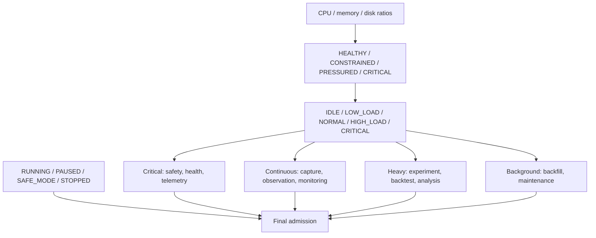
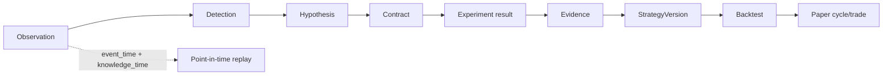
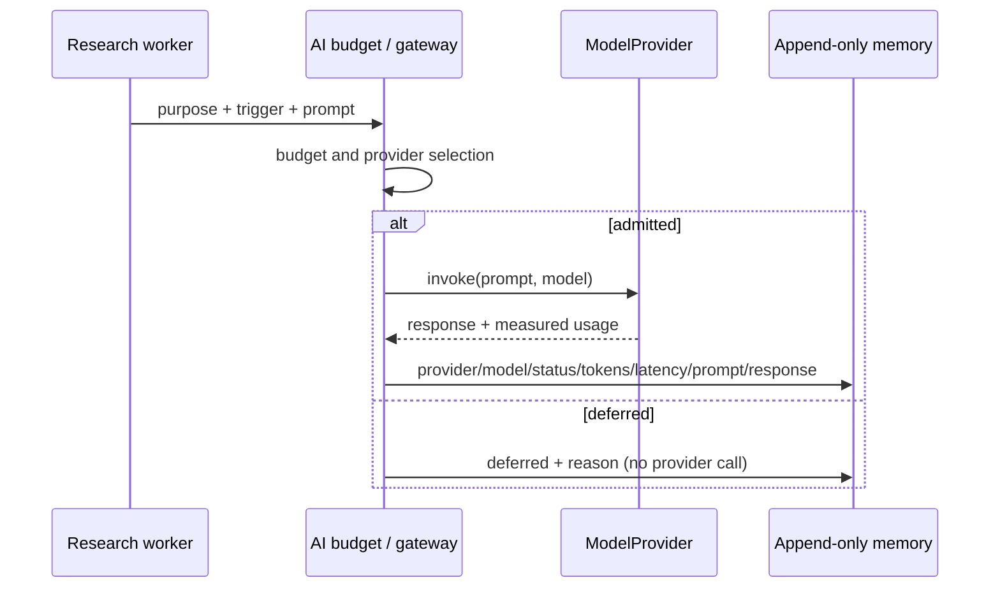

# Living Quant architecture

Status: Phase 10.5 autonomous validation campaign. Phase 11 live promotion is
locked and requires a deliberate human decision.

## System boundaries

```mermaid
flowchart LR
  Sources[Market, news and event sources] --> Recorder[Deterministic recorder]
  Recorder --> Memory[(Bitemporal append-only memory)]
  Memory --> Observe[Observatory]
  Observe --> Hypothesis[Hypothesis + falsification]
  Hypothesis --> Contract[Immutable experiment contract]
  Contract --> Experiment[Replay / experiment]
  Experiment --> Evidence[Evidence + comparison]
  Evidence --> Version[Immutable StrategyVersion]
  Version --> Backtest[Strategy backtest]
  Backtest --> Eligibility{Explicit paper eligibility}
  Eligibility -->|approved| Paper[Isolated paper engine]
  Eligibility -->|not approved| Blocker[Concrete blocker]
  Paper --> Attribution[Paper attribution / decay]
  Attribution --> Memory
  Version -. no automatic edge .-> Live[Live engine]
  Live:::locked
  classDef locked fill:#481b1b,stroke:#e0554f,color:#fff
```

The live engine, research system, and paper simulator are separate packages.
Research cannot import broker execution. Paper cannot import broker execution.
The dashboard is read-only except for narrowly audited runtime-mode and AI
provider settings. Neither administrative action can place or alter an order.

## Control and capacity plane

`control/resources.py` measures physical capacity. `control/capacity.py`
normalizes it and produces an explainable allocation. It never starts work;
workers consult the plan at natural throttle points. All thresholds are ratios,
so a VPS resize does not invalidate the policy.

## Data and lineage

Raw observations use both event time and knowledge time. Experiments read only
through the knowledge-time gate. Corrections append revisions; observation and
price history cannot be updated or deleted. Strategy implementations and
parameters are content-addressed and immutable.

`research.validation` creates append-only campaign snapshots with counts and
conversion rates across this funnel. A snapshot is observational: it cannot
approve an experiment, register a strategy, or start a paper cycle.

## News and event plane

News adapters preserve first-seen time as knowledge time, publisher time as an
untrusted claim, stable provider identity, and polling resolution. Deterministic
features (lexical polarity, urgency, size and method version) are captured with
the raw event. News-derived strategies face the same immutable contract,
out-of-sample, cost, evidence, and paper gates as price-derived strategies.

## Model-provider plane

Providers implement `ModelProvider.invoke`. Credentials stay in CLI sessions or
server environment variables; configuration stores only provider/model names.
Unknown token counts and costs remain null rather than being invented. Prompt
and response text is bounded and visible only through authenticated artifact
detail views.

## Broker plane

Every adapter exposes normalized funds, holdings, positions, quotes and order
operations plus a non-network `BrokerCapabilities` descriptor. Unsupported
history reads fail explicitly. Account holdings outside the autonomous mandate
remain unmanaged: visible for reconciliation, never available capital and never
sellable by the agent.

## Paper admission and Phase 11 lock

A registered version is not paper eligible by default. Paper eligibility is an
append-only, attributable human decision. The validation status reports a
specific blocker when no version qualifies instead of manufacturing activity.
Nothing in Phase 10.5 creates a live-promotion route. The only live execution
entry remains the guarded `engine.execute propose` workflow.

## Operations

- `python -m research.validation` captures a durable validation snapshot.
- `GET /validation/status` returns current funnel, capacity and blockers.
- `GET /resources/status` includes the current allocation plan.
- The Validation dashboard exposes funnel, capacity, blockers and history.
- Secrets are never committed, returned by APIs, or placed in browser storage
  except the user-entered admin session token already required by the UI.
